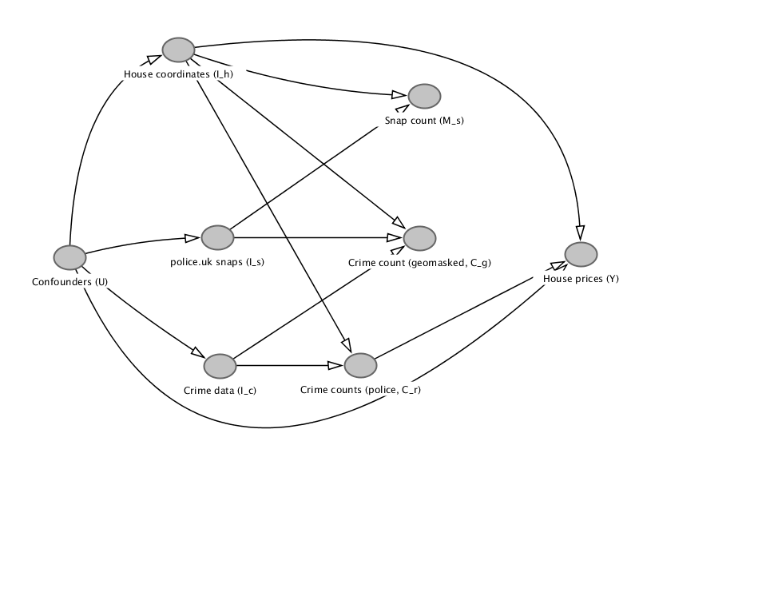

## A2. DAG with more confounders

Additional variables are:

- $I$ represent entire information sets/ datasets with a subscript denoting different information.
  - $I_s$ is the secret list of snap-points used by police.uk. We know how $I_s$ was constructed (see supplement S3).
  - $I_c$ represents crimes, where they occur and crime type. The level of crimes around a house (summarised by $C_r$) affects house prices in various ways (e.g. property destruction).
  - $I_h$ represents houses and their characteristics, including their location.

Other variables retain the same meaning. The simpler DAG in the main text treats $I$ as items in the larger set of confounders $U$.

  
  __Figure 1: DAG/ Path diagram of causal relations during the control period__

The purpose of this DAG is to show that:
1. $M_s$ is purely a function of two only inputs: $I_h$ and $I_s$.
2. Crime count shown $C_g$ on police.uk is a function of only three inputs: $I_h$, $I_s$, and $I_c$
3. The pathway between map features $M_s$ and $C_g$, and all other confounders $U$ are intercepted by $I_h$, $I_s$, and $I_c$. Therefore three information sets are the key sources of confounding.
